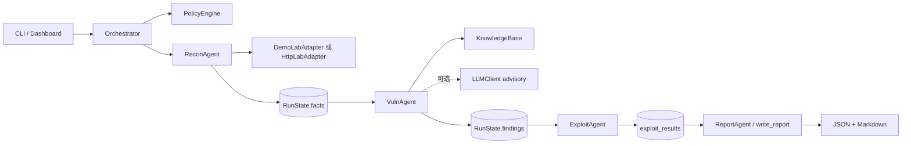

# Harness MVP 项目总结报告

报告日期：2026-09-09  
审阅范围：工作区内全部 Python 源码、靶场配置、测试、README 与设计文档。  
结论性质：以下“已验证”内容来自源码阅读、实际命令或测试结果；“限制”和“建议”是基于实现的工程判断。

## 1. 执行摘要

本项目是一个面向课程演示的、零第三方依赖的安全多 Agent Pentest Harness 原型。Harness 可以理解为“统一管理 Agent、共享状态、工具调用、范围策略、失败处理和报告输出的运行框架”。项目把一次评估拆成 Recon（侦察）、Vuln（漏洞分析）、Exploit（验证）和 Report（报告）四个角色，由 `Orchestrator` 按固定计划串行调度。

项目最适合展示以下能力：专职 Agent 之间通过结构化状态传递信息；所有目标和工具操作经过白名单策略；失败最多重试两次并留下事件；结果同时输出机器可读 JSON 和答辩可读 Markdown；在没有 API Key 和额外包的情况下也能离线运行。

当前实现仍是 MVP，而不是可对真实目标自主执行的渗透平台。Demo 适配器在进程内返回固定文本，漏洞检测依赖教学标记，Exploit Agent 在隔离 local-web 训练服务中可用固定正负输入完成 `verified` 差分验证；Demo 仍只生成 `simulated` 记录，不发送任意载荷。课程文档已经明确指出，GOAD Windows 域、ExploitGym 指定任务 `v8:sbxbrk/398773898` 加第二任务、复杂网络靶场尚未完成真实验收。其中 **ExploitGym 已完成"真实验收"里的"真实运行"部分**：官方第 1–7 步在本机全部跑通，两个任务都产生了真实轨迹并由官方 scorer 评分（均为 0.0，**未通过**，原始证据在 `lab/exploitgym/evidence/`）；**GOAD Windows 域仍未搭建**。运行状态现可通过带版本的 checkpoint 文件在进程重启后恢复，但尚未具备任务取消、锁租约或环境快照回滚。

## 2. 项目范围与技术画像

| 项目 | 结论 |
|---|---|
| 语言与版本 | Python 3.10+；当前运行环境测试通过 |
| 依赖 | `pyproject.toml` 中 `dependencies=[]`，仅使用标准库 |
| 生产代码规模 | `harness_mvp` 与 `lab` 共 909 行 Python（含空行和注释） |
| 测试规模 | `tests/` 共 26 个标准库测试用例 |
| 主要入口 | `python -m harness_mvp`，由 `__main__.py` 转到 CLI |
| 运行模式 | `demo`、`local-web`；Agent 决策模式为 `auto`、`deterministic`、`llm` |
| 输出 | `<run_id>.json` 与 `<run_id>.md` |
| Web 界面 | Python 标准库 `ThreadingHTTPServer` 内嵌单页 HTML，无前端框架 |
| 外部服务 | 可选 OpenAI-compatible `/chat/completions`；默认不联网 |

根目录还包含 `docs/` 课程要求审计、参考项目比较、真实靶场运行手册、演示脚本和课程映射；`out*` 目录保存历史运行样例，不属于执行逻辑。`lab/` 包含本地训练服务及 Docker 配置，`tests/` 提供单元和集成式链路验证。

## 3. 总体架构与执行链



一次 `run()` 的实际顺序如下：

1. CLI 或 Dashboard 创建 `Orchestrator`，解析目标并由 `PolicyEngine` 验证目标范围。
2. 对 `local-web` 场景，在默认使用 `DemoLabAdapter` 时切换为 `HttpLabAdapter`；`demo` 场景完全使用固定响应，不访问网络。
3. `plan()` 创建四个固定 `PlanStep`：侦察、分析、验证、报告，每步 `max_attempts=2`。
4. Recon 探测五个固定路径，写入 `RunState.facts["endpoints"]` 和 `reachable`。
5. Vuln 读取响应摘要中的教学标记，生成 Finding，并从本地知识库关联 CWE/修复建议；配置模型时额外保存 advisory。
6. Exploit 在 local-web 中检查 `exploit_validate_sqlite` 权限并执行固定正负验证；Demo 仍检查 `exploit_simulate` 并写入模拟结果。
7. Report Agent 构建汇总，Orchestrator 最后把状态写成 JSON 和 Markdown。
8. 任一步抛出异常时，Orchestrator 记录错误并重试一次；最终仍失败则把运行状态标为 `failed`，但仍尝试写报告。

## 4. 全部代码模块说明

### 4.1 数据模型：`harness_mvp/models.py`

该文件用 dataclass 和 Enum 定义跨 Agent 共享的状态契约。

- `Target` 保存 host、port、scheme，`address` 属性生成完整地址。
- `ProbeResponse` 保存路径、状态码、响应头、正文摘要、延迟、来源和扩展元数据。
- `Finding` 保存发现 ID、标题、严重性、描述、端点、证据、修复、CWE、置信度、是否可利用、来源和元数据。
- `AgentResult` 保存 Agent 状态、摘要、结构化数据、错误和观察项。状态为 `success`、`skipped` 或 `failed`。
- `Event` 保存 UTC 时间、阶段、消息和详情，是运行时间线的基本记录。
- `PlanStep` 保存计划名、Agent 名和重试上限。
- `RunState` 保存目标、场景、随机 12 位运行 ID、运行状态、facts、findings、exploit results、各 Agent 结果、事件、错误和报告路径。`add_event()` 统一写时间线，`to_dict()` 用 `asdict()` 序列化。

模型层的优点是结构清晰、可序列化、无需数据库；checkpoint 层补充了带 schema 的原子落盘和恢复协议，但仍没有并发租约或数据库级协调。

### 4.2 范围和权限：`harness_mvp/policy.py`

`ALLOWED_HOSTS` 只包含 `demo.local`、`localhost` 和 `127.0.0.1`；动作白名单包含 `recon_probe`、`vuln_analyze`、`exploit_simulate` 和 `report_write`。

`parse_target()` 支持带或不带协议的 HTTP/HTTPS 地址，拒绝空目标、用户名密码、路径、查询、片段、非法端口和非 HTTP(S) 协议。`PolicyEngine` 再检查主机精确匹配和端口范围。`require_action()` 将动作名和目标检查合并成工具调用前的门禁。

命令执行策略更严格：`SafeCommandRunner` 只接受 `python --version`、`python.exe --version` 或 `py --version`，并且调用 `subprocess.run(..., shell=False)`。因此模型不能通过该接口执行任意 Shell 命令。

边界仍有工程缺口：传入已经构造好的 `Target` 对象时没有重新规范化 scheme/host；HTTP 客户端没有显式阻断重定向；白名单 localhost 服务仍可能被滥用为 SSRF 跳板；策略没有按 Agent 区分资源额度、网络出口、认证凭据和人工审批。

### 4.3 工具和知识：`harness_mvp/tools.py`

`KnowledgeBase` 内置 12 条 CWE 教学知识，`search()` 使用标准库 TF-IDF 和余弦相似度排序，返回可解释分数、CWE、来源和修复建议。它仍不是生产级向量数据库或真实漏洞数据集。

`DemoLabAdapter` 有五个固定路由 `/`、`/login`、`/search`、`/admin`、`/health`，直接返回确定性 `ProbeResponse`，不发起网络请求。其文本标记分别用于触发三类发现。

`HttpLabAdapter` 面向明确授权的本地 HTTP 靶场，只发 GET；探测路径固定为五个白名单路径，SQLi 验证只接受内置的正负课程输入，超时限制在 0.1–3 秒，正文读取上限为 16 KiB，并记录请求 URL、状态、响应头、正文摘要、响应哈希和响应字节数。它禁用环境代理、拒绝重定向，并要求训练服务握手头。`http_probe()` 是一个独立的受限 GET 辅助函数，超时上限为 2 秒。

`SafeCommandRunner` 负责执行前述固定诊断命令，`json_dumps()` 提供统一 JSON 格式化辅助。

### 4.4 Agent：`harness_mvp/agents.py`

`Agent` 是抽象基类，要求实现 `run(state) -> AgentResult`。

- `ReconAgent` 固定探测五个路径，把每个响应的 `__dict__` 放入共享 facts，并根据是否存在低于 500 的响应设置 `reachable`。
- `VulnAgent` 在 Demo 中读取固定教学标记；在 local-web 中根据 baseline、固定正向输入和固定负向输入造成的真实结果差异，以及虚构课程 proof，生成 SQLite SQLi CWE-89 Finding。Demo 发现标为 `demo-simulated`；local-web 发现标为 `http-lab`，并保存检索分数、请求证据哈希和验证状态。
- 当 `LLMClient` 存在时，Vuln Agent 把已观测的端点摘要交给模型，要求返回 `risk_summary`、`recommended_next_step`、`confidence` JSON。模型建议只被存档，不替代确定性规则，也不产生载荷。
- `ExploitAgent` 没有发现时返回 `skipped`；local-web SQLi 经过 `exploit_validate_sqlite` 策略门禁，以及 baseline/正向/负向固定 GET 差分验证，输出 `verified` 或 `failed`；验证过程抛错时 Agent 返回 `failed` 并使整次运行失败。Demo 或其他发现仍输出 `simulated`，不发送任意载荷。
- `ReportAgent` 调用 `build_report()`，为编排器提供报告汇总结果。

`make_agents()` 将适配器、策略、知识库和可选模型组装成四个 Agent。当前 Agent 是串行共享上下文，尚无并行任务树、独立上下文、动态重规划、后渗透或代码审计角色。

### 4.5 编排：`harness_mvp/orchestrator.py`

构造函数支持注入 Policy、适配器、知识库和 LLM 客户端。`mode=llm` 在没有 `HARNESS_LLM_API_KEY` 时立即报配置错误；`auto` 在有 Key 时启用 advisory，否则退回确定性模式；`deterministic` 永不使用模型。

`run()` 先解析目标，再根据场景选择适配器，创建 `RunState` 并记录计划。每步循环最多两次，异常会被转换为失败的 `AgentResult`，同时写入 `state.errors` 和 `agent failed; retrying` 事件。Recon 最终失败会清空攻击面并继续；Vuln 或 Exploit 失败会留下反应事件并让报告包含失败信息。只要任一最终 Agent 结果是 `failed`，运行整体就是 `FAILED`，否则是 `COMPLETED`。

该设计展示了“计划—执行—有限恢复”的最小闭环。`plan()` 仍返回相同四步，尚无替代工具或环境快照回滚；但每步状态会原子写入带 schema 的 checkpoint，`--resume` 可跳过成功前缀并从首个失败步骤重建后续依赖结果。

### 4.6 报告：`harness_mvp/report.py`

`build_report()` 统计严重性数量，并包含运行 ID、目标、场景、状态、发现、验证结果、Agent 结果、checkpoint、facts、事件和错误。`render_markdown()` 输出来源、验证状态和证据哈希说明，并把 `simulated` 与 `verified` 分开解释。`write_report()` 创建输出目录，写入 `<run_id>.json` 和 `<run_id>.md`，并返回绝对路径。

报告链路可审计且易读；local-web 已记录请求 URL、响应摘要、响应 SHA-256、正负差分和验证状态。仍没有截图、ground truth、风险接受和整改复测字段。

### 4.7 可选模型客户端：`harness_mvp/llm.py`

`ModelConfig.from_env()` 从 `HARNESS_LLM_API_KEY`、`HARNESS_LLM_BASE_URL`、`HARNESS_LLM_MODEL`、`HARNESS_LLM_PROVIDER` 读取配置；API Key 的 dataclass `repr` 被隐藏。`LLMClient.advisory()` 使用标准库 `urllib` 向 `{base_url}/chat/completions` 发温度为 0 的 JSON 请求，超时限制在 3–30 秒，解析 `choices[0].message.content` 中的 JSON 对象，并对 HTTP、网络和格式错误抛出明确异常。

Key 不写入报告或日志，但会发送到配置的服务；Base URL 可被环境变量改成任意地址，生产使用前需要出口限制、域名白名单、秘密注入和响应 schema 校验。

### 4.8 靶场就绪检查：`harness_mvp/labs.py`

`check_labs()` 明确声明只读，不启动环境、不执行 payload。它检查 Docker Server 版本、本地 `127.0.0.1:18088/health`，以及 `GOAD_ROOT`、`EXPLOITGYM_ROOT`、`VULHUB_ROOT` 指向目录和关键文件。`checks_as_json()` 提供 JSON 输出。

该检查器证明“环境是否可用”，不证明环境中的漏洞、权限路径或 ExploitGym scorer 已通过。

### 4.9 Dashboard：`harness_mvp/dashboard.py`

Dashboard 使用标准库 `ThreadingHTTPServer`。根路径返回内嵌单页 HTML：可选择 Demo 或 Local Web 场景，提交后创建后台任务，前端轮询状态并显示步骤、发现卡片和报告链接。API 路由为：

- `POST /api/runs`：接收 `target`、`scenario`、`output`，快速返回 202 和任务 ID；后台以确定性模式运行完整 Harness。
- `GET /api/runs/{id}`：返回完整 `RunState`。
- `GET /api/runs/{id}/report`：读取 Markdown 报告。

运行缓存是类变量字典并受锁保护，但只存在内存；服务重启即丢失。POST 已增加 JSON Content-Type 检查、Content-Length/请求体上限、输出目录根约束、活动任务上限和后台执行；仍没有认证、CSRF、持久化队列或取消接口。

### 4.10 CLI 与包入口：`harness_mvp/cli.py`、`__main__.py`、`__init__.py`

CLI 提供 `--scenario`、`--target`、`--output`、`--serve`、`--port`、`--check-labs` 和 `--mode`。`--check-labs` 只打印检查结果后退出；策略违规和配置错误返回码 2；运行失败返回码 1；完成返回码 0。`__main__.py` 只负责调用 `cli.main()`，`__init__.py` 导出 `Orchestrator`。

### 4.11 本地训练服务：`lab/app.py` 与容器配置

`lab/app.py` 是一个只读的 `ThreadingHTTPServer`，在五个固定路由返回 HTML；`/search` 使用内存 SQLite 的故意字符串拼接漏洞，另有 `--fixed` 参数用于参数化查询对照，未知路径返回 404；默认绑定 `127.0.0.1:8088`。`docker-compose.yml` 将容器端口映射到宿主机 `127.0.0.1:18088`，启用只读文件系统、丢弃全部 Linux capabilities、`no-new-privileges` 和不自动重启。`Dockerfile` 使用 `python:3.12-slim`，以 UID/GID `65532:65532` 非 root 用户运行。

容器隔离设置适合本地教学服务，但它仍不是 GOAD、ExploitGym 或复杂网络环境的替代品。

## 5. 状态、数据流和输出契约

一次成功 Demo 运行会在 `facts` 中保存：`agent_mode`、四步计划、五个端点响应和 `reachable=true`；local-web 还保存响应哈希和 SQLite 正负验证。Demo 有三条模拟发现，local-web 有一条真实本地训练 SQLi 发现；`agent_results`、`events`、`checkpoint` 和错误信息都会写入报告。

本次实际运行验证到的结果是：

- Demo：`completed`，3 条模拟发现（critical 1、high 1、medium 1），3 条 `simulated` 验证。
- local-web 易受攻击版：`completed`，1 条 `http-lab` CWE-89 发现，固定正负 GET 差分状态 `verified`。
- local-web `--fixed` 对照版：`completed`，0 条发现，证明参数化查询不会触发该规则。
- 两种 local-web 运行均侦察 5 个端点，并把请求 URL、响应摘要和 SHA-256 写入状态。
- 报告：JSON 和 Markdown 均成功生成

报告样例可见 `out/604ed6d7502e.json` 和 `out/604ed6d7502e.md`；本次新生成的验证输出位于 `out-summary-check/`。

## 6. 测试与实际验证证据

执行命令：

```powershell
python -m unittest discover -s tests -v
```

结果：27 项全部通过，覆盖：Demo 三发现和报告、本地 HTTP 适配器真实差分链路及修复版对照、Exploit 验证异常失败语义、目标解析、越界目标阻断、只读靶场检查、LLM Key 不序列化与 JSON 解析、瞬时 Agent 失败重试、checkpoint 恢复与损坏拒绝、Dashboard API 请求限制和 ExploitGym 只读适配器。

另外实际执行了：

```powershell
python -m harness_mvp --scenario demo --target demo.local --output out-summary-check
python -m harness_mvp --check-labs
```

Demo 命令返回 `completed`，生成三条模拟发现；local-web 测试返回一条 `http-lab` SQLi 发现并完成 `verified` 验证。就绪检查显示 Docker Server `29.4.1` 可用；本机未启动 local-web 时健康检查超时；GOAD、ExploitGym 和 Vulhub 的环境变量均未配置。因此只能确认 MVP 和本地训练代码可运行，不能据此确认三类课程真实靶场已通过。

测试尚未覆盖生产级并发压力、真实 Docker 启停、跨机器恢复、外部 ExploitGym scorer 和 GOAD/Vulhub 验收。

补充检查 `python -m compileall -q harness_mvp lab tests` 通过，源码无语法编译错误。工作区没有 `.git` 目录，因此本报告不评价提交历史、分支策略或版本回归。部分历史审计文档仍写旧的测试数量；本报告以当前源码和实测结果为准。

## 7. 安全性评估

已实现的安全控制包括：默认目标白名单；目标格式严格解析；动作白名单；固定诊断命令；所有 subprocess 使用 `shell=False`；HTTP GET 有超时和正文上限；Demo 默认不联网；Exploit 明确不发送 payload；本地容器非 root、只读、丢弃 capabilities；报告不包含 LLM Key。

需要优先修复的风险包括：

1. Dashboard 无认证和跨用户隔离；虽然任务已后台执行并限制活动任务数，仍应只绑定 loopback，不能直接暴露到网络。
2. Dashboard 已将 `output` 限制在配置的输出根目录，但部署者仍需设置目录权限并审查符号链接。
3. local-web 客户端已禁用环境代理、拒绝重定向并要求训练服务握手；真实环境接入仍需独立网络隔离和出口控制。
4. `Target` 对象绕过字符串解析时，scheme 和 host 规范化不完整。
5. LLM Base URL 与 API Key 由环境配置，缺少出口白名单、响应字段校验和敏感信息过滤。
6. Demo 的固定 marker 检测仍会产生教学场景特有的误报/漏报；只有 local-web 的固定差分验证会将 `exploitable` 更新为真。
7. checkpoint 已支持同机文件恢复，但没有任务取消、锁租约、数据库级并发协调、跨机器恢复或环境快照回滚。

## 8. 与课程目标的符合度

项目已经具备课程设计中“设计与原型”层面的证据：四个专职角色、共享状态、计划执行、有限重试、知识关联、范围策略、结构化报告和本地演示靶场。

尚未具备课程“完整测试验收”层面的证据：没有 GOAD 域控与多节点实测，没有 ExploitGym 指定任务和第二任务的官方 scorer 结果，没有复杂网络靶场的原始证据，也没有真实成功率、误报率、耗时和单 Agent 基线。课程文档中的准确表述应是“已完成安全边界清晰的 Harness MVP，真实靶场适配与验收进行中”。

## 9. 建议的后续实现顺序

1. 为本地训练漏洞补齐原始请求/响应、复现步骤、版本、重置和清理记录；当前已保存摘要、请求 URL、响应哈希和差分结果。
2. 为每个 Agent 增加独立输入、输出、工具权限、超时和审计记录；当前已有目标/动作门禁与 Dashboard 输出根约束。
3. 为 checkpoint 增加任务取消、锁租约、并发协调和环境快照回滚；当前已实现带 schema 的原子写入、恢复和失败步骤重跑。
4. 接入一个 OpenAI-compatible 模型，但保留确定性 fallback；使用严格 JSON schema，过滤秘密和超出证据的建议。
5. 按 Argus/OWASP 风格增加 manifest、ground truth、trace 和断言，记录越界调用、工具拒绝、发现正确率、报告完整度、耗时、成本和重试次数。
6. 在隔离授权环境中逐步接入复杂 Web、ExploitGym 两个任务和 GOAD；每个环境单独维护授权、版本、启动/重置/清理命令和验收标准。
7. 最后再扩展代码审计、后渗透、横向移动和并发任务树，避免在真实证据不足时单纯增加 Agent 数量。

## 10. 最终判断

从代码质量和可演示性看，这是一个结构小、边界明确、可离线运行的课程原型。其强项是把 Agent、策略、状态、重试和报告串成可复核的最小闭环；其核心限制是 Demo 仍停留在固定文本识别和模拟验证；local-web 仅覆盖一个隔离 SQLite 训练漏洞，外部靶场和真实成功率尚未验收。任何对外材料都应明确标记 `demo`、`local-real` 和 `external-benchmark`，不能把三条模拟发现写成真实主机上的利用成功。


